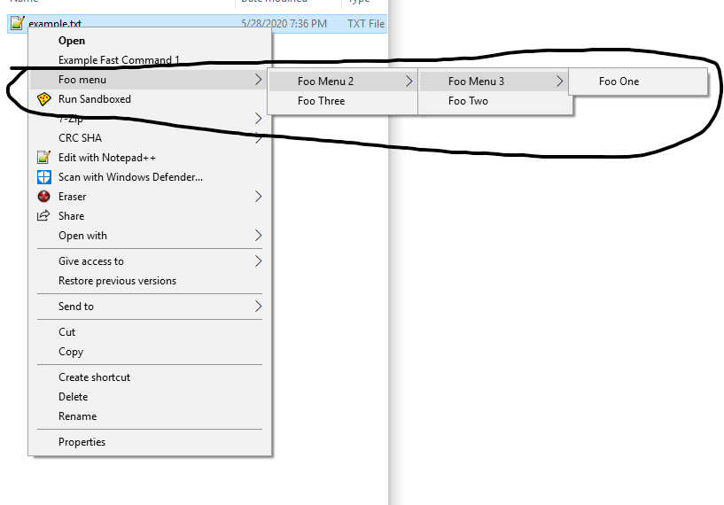

<h1 align='center'> context_menu </h1>

<p align='center'>A Python library to create and deploy cross-platform native context menus.</p>


---

<p align='center'>
  
</p>
<!--       -->

---


# Quickstart

1. Install the library via pip:
```
python -m pip install context_menu
```
2. Create and compile the menu:
  * You can create items in as little as 3 lines:
    ```python
    from context_menu import menus
    fc = menus.FastCommand('Example Fast Command 1', type='FILES', command='echo Hello')
    fc.compile()
    ```
  * Or you can create much more complicated nested menus:
```Python
        def foo2(filenames):
            print('foo2')
            print(filenames)
            input()

        def foo3(filenames):
            print('foo3')
            print(filenames)
            input()

        if __name__ == '__main__':
            from context_menu import menus

            cm = menus.ContextMenu('Foo menu', type='FILES')
            cm2 = menus.ContextMenu('Foo Menu 2')
            cm3 = menus.ContextMenu('Foo Menu 3')

            cm3.add_items([
                menus.ContextCommand('Foo One', command='echo hello > example.txt'),
            ])
            cm2.add_items([
                menus.ContextCommand('Foo Two', python=foo2),
                cm3,
            ])
            cm.add_items([
                cm2,
                menus.ContextCommand('Foo Three', python=foo3)
            ])

            cm.compile()
```
3. See the output!
  * First example

  

  * Second example

  

# Detailed Usage

The [ContextMenu]() class expects a name, and the activation type if it is the root menu(the first menu). Only compile the root menu.

The [ContextCommand]() class expects a name, and either a python function, or a shell command, but not both. A ContextCommand is the selectable element of a context menu; you can click this part. Python functions can be passed to this method, regardless of their location. However, if the function is in the same file as the menu, you have to surround it with `if __name__ == '__main__':`

Any command passed (as a string) will be directly ran from the shell.

```Python
def foo2(filenames):
    print('foo2')
    print(filenames)
    input()

def foo3(filenames):
    print('foo3')
    print(filenames)
    input()


if __name__ == '__main__':
    from context_menu import menus

    cm = menus.ContextMenu('Foo menu', type='DIRECTORY_BACKGROUND')
    cm.add_items([
        menus.ContextCommand('Foo One', command='echo hello > example.txt'),
        menus.ContextCommand('Foo Two', python=foo2),
        menus.ContextCommand('Foo Three', python=foo3)
    ])
    cm.compile()

```
The [FastCommand]() class is an extension of the ContextMenu class and allows you to quickly create a single entry menu. It expects a name, type, and command/function.

```python
def foo1(filenames):
    print(filenames)
    input()

if __name__ == '__main__':
    from context_menu import menus

    fc = menus.FastCommand('Example Fast Command 1', type='FILES', python=foo1)
    fc.compile()
```


You can use the [{MENU}.add_items{ITEMS}]() function to add these elements together. Menus can be added to menus, creating cascading context menus. You have to call [{MENU}.compile()]() in order to create the menu. Admin privileges are required on windows, as it modifies the Registry. The code will automatically prompt for Admin rights if it is not sufficiently elevated.

Check out the [examples folder](examples) for more complicated examples.

# Final Words

You can check out the entire [documentation here].

I'm extremely pleased with how this project turned out. I can't count how many times I wanted to give up. All the interfaces I had to interact with almost zero documentation ([nautilus-python](https://wiki.gnome.org/Projects/NautilusPython) actually had no documentation, but I'm extremely thankful the library existed in the first place). I wanted to contribute and open up the possibility of using context menus in development to more people, creating this library and [documentation for windows](https://medium.com/analytics-vidhya/creating-cascading-context-menus-with-the-windows-10-registry-f1cf3cd8398f).
